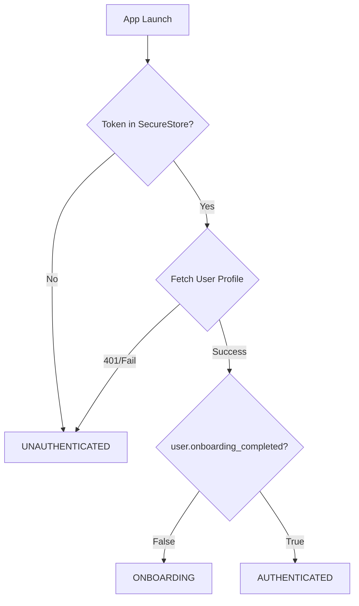

# Authentication & Navigation Architecture

## 1. Auth Gate Logic (State Machine)
The Application Root (`_layout.tsx` or `AuthContext`) must act as a strict gatekeeper.

### States
1.  **LOADING**: App is initializing, checking SecureStore. -> *Render Splash Screen*.
2.  **UNAUTHENTICATED**: No token found or token invalid. -> *Redirect to `(auth)/welcome`*.
3.  **ONBOARDING**: Token valid BUT `onboarding_completed: false`. -> *Redirect to `(onboarding)/name`*.
4.  **AUTHENTICATED**: Token valid AND `onboarding_completed: true`. -> *Redirect to `(tabs)/profile`*.

### Decision Tree

## 2. Route Group Responsibilities

### `(auth)` Group
*   **Purpose**: Publicly accessible screens for entry.
*   **Screens**: Welcome, Phone Login, OTP/Password Verify.
*   **Rule**: Accessible ONLY if `user === null`. If logged in user tries these routes, auto-redirect to Tabs or Onboarding.

### `(onboarding)` Group
*   **Purpose**: Data collection for new users.
*   **Screens**: Name, Birthday, Photos, etc.
*   **Rule**: Accessible ONLY if `user !== null` AND `user.onboarding_completed === false`.
*   **Exit Condition**: User completes flow -> Backend sets `onboarding_completed=true` -> Client refreshes profile -> Gate redirects to Tabs.

### `(tabs)` Group
*   **Purpose**: Main Application (Discovery, Matches, Profile).
*   **Screens**: Home, Matches, Profile.
*   **Rule**: Accessible ONLY if `user !== null` AND `user.onboarding_completed === true`.
*   **Protection**: If unauthenticated user tries deep link here, bounce to Welcome.

## 3. Sign Out Behavior
*   **Trigger**: User taps "Logout" in Settings.
*   **Actions**:
    1.  `SecureStore.deleteItemAsync('auth_token')`.
    2.  `setToken(null)`.
    3.  `setUser(null)`.
*   **Result**: State becomes **UNAUTHENTICATED**.
*   **Redirect**: Immediate navigation to `(auth)/welcome`.

## 4. Implementation Rules for Frontend
1.  **Single Source of Truth**: Do NOT duplicate navigation logic in screens. Put all redirects in `AuthContext`'s `useEffect`.
2.  **Loading State**: Never show "Welcome" screen while loading. Show a white screen or spinner until the token check completes.
3.  **Race Conditions**: When "Continuing" from Onboarding, ensure you `await refreshProfile()` BEFORE navigating. Let the AuthContext handle the navigation change naturally.
